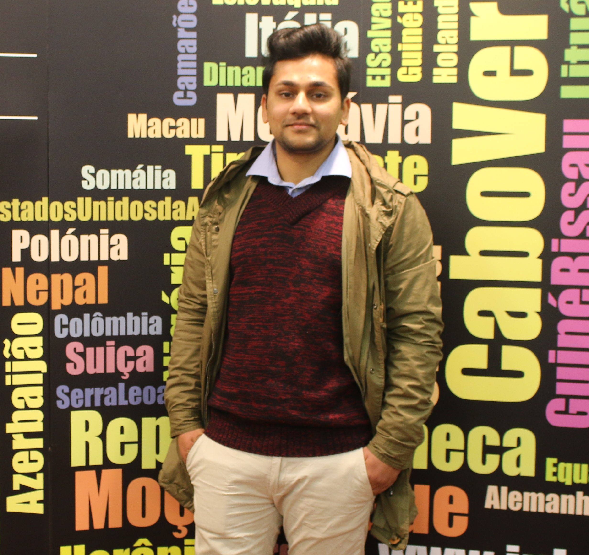

# Mausam Tiwari

*Failure is inevitable. What you can do is just anticipate the failure, handle it properly, learn form what went wrong and manage it.*

## I am a humble, hard working, motivated and tech-savvy person having a great interest in web development, app development and database management.

|Birthday|Favourite color|Favourite food|Pineapple on pizza|
|-|-|-|-|
|01/09/1995|Black,White,Gray|Dumplings|<ul><li>[x] Yes. Am I accepted? :stuck_out_tongue_winking_eye:&nbsp; </li> <li>[ ] No</li> </ul>|

### Hobbies
* Movies
  * Green Book
  * 3 idiots
  * The wolf of wallstreet
* Sport
  * Football (Watching Real Madrid play is :heartpulse: &nbsp; )
  * Cricket
* Travelling
* Watching youtube videos 
  * Vlogs
  * Stand-Up comedy
  * Motivational videos
  * Tech related videos

#### You can always count me on when...
  you need a good friend 😇  :innocent: &nbsp; .

#### A funny story
  When I was in college, I went out to party with some of my friends. I was drunk as skunk that night. And later after the party, we went out to roam around the city though we barely could stand still. The following morning when I woke up whole my body was in pain, as if I was beaten to death :smile: &nbsp; . I called one of my friends who were with me last night as I had no idea what I had done. Only then, I came to know that I did some HIT workouts :grinning: &nbsp; . I had done 60 push ups, tried one hand push up and even hung upon a branch of tree to try pull ups, which I don't even try when I am sober. I did not beleive him until I saw the video of me doing such stupidity. 

##### TLDR
  I possess super powers when I am drunk. :muscle:  

<< [Mattias](https://github.com/WiseCoding/markdown-warmup-css) || [Mausam](https://github.com/ErAsuratya/markdown-warmup-css) || [Miroslav](https://github.com/miroslavveljanoski/markdown-challenge/blob/master/README.md) >>
